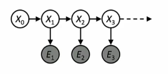

- Hidden Markov Models
	- 状态X上的潜在马尔可夫链
	- 你可以近似想象成BN它们还是同一个连通图，因此应该条件无关，于是有(这是和BN一致的，在给定parent的情况下，X与其非后代独立)
		- 在每个时间步观察证据Et，给定当前隐藏状态 Xt 时，当前观测 Et 与过去无关
		- Xt是一个单个离散变量，给定前一个隐藏状态 Xt−1​时，Xt 与更早的观测与状态无关
		- Et可能是连续的，可能由多个变量组成
	- 它的主要构成
		- Initial distribution: P(X0)
		- Transition model：P(Xt| Xt-1)
		- Sensor model： P(Et|Xt)
	- Joint distribution --- $P(X_0, E_0,X_1,E_1,..., X_T, E_T) = P(X_0) \prod_{t=1:T} P(X_t| X_{t-1}) P(Et| Xt)$
	- 形态
		- 

- Inference tasks with HMMs
	- Filtering : $P(X_t|e_{1:t})$
		- belief state -- 输入到理性代理决策过程中的内容
	- Prediction：$P(X_{t+k}|e_{1:t})$ for k>0
		- 评估可能的行为序列；如无证据的Filtering
	- Smoothing：$P(X_k|e_{1:t})$ for $0 \le k < t$
		- 更精确地估计过去状态，这对于学习至关重要
	- Most likely explanation：$arg max_{x_{1:t}}P(x_{1:t}|e_{1:t})$
		- 语音识别，带噪声信道的解码

- Filtering algorithm
	- $P(X_{t+1}|e_{1:t+1})=g(e_{t+1},P(X_t|e_{1:t}))$
	- 算法推理细节，其中用到条件概率、边缘分布等方法![[HMMFilter.png]]
	- 补充解释![[补充解释HMMFiltering.png]]
	- $\alpha$ 在实践上是对后面求得的概率分布作归一化
	- 由上述过程，我们也可以得到 `Forward algorithm`
		- $f_{1:t+1}=FORWARD(f_{1:t},e_{t+1}) \ ; f_{1:t} = P(X_t|e_{1:t})$
		- $for \ t=0, \ e_{1:0}=empty$
	- 例子![[HMMsFilterExample.png]]

- Most Likely Explanation
	-  State trellis 状态格: 状态和随时间变化的转换图
	- 过程![[MostLikelyExaplanation.png]]

	- 形式
		- ![[StateTrills.png]]
	- 每个弧代表某种转换 Xt-1 -> Xt
	- 每个弧的权重为 P(xt | xt-1) P(et I xt)（指向初始状态的弧权重为 P(x0)）
	- 路径上权重的乘积与该状态序列的概率成正比 
	- Forward Algorithm(Filtering algorithm) 前向算法计算路径之和，Viterbi 维特比算法计算最佳路径
	- Viterbi 运行的例子
		- ![[ViterbiExample.png]]
	- Viterbi 算法本质上其实是最短路径算法(广度优先图搜索)，理由是我们对arc上的值取log，同时添加负号就是找最短路径了

