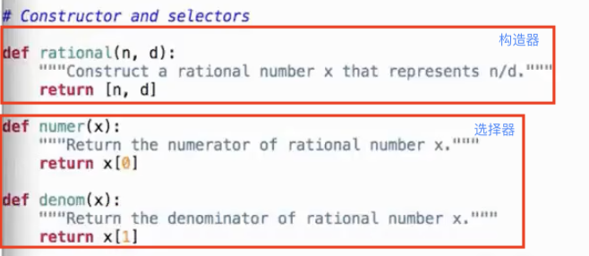

- 数据表示
	- 数据抽象使用 `selectors` 和 `constructors` 来定义行为
	- 数据抽象的本质是通过它的行为识别
	- 具体实现可能不同，例如有理数的`构造`返回可能是列表也可能是函数，它的`选择`也会因构造的不同而改变
- 抽象屏障
	- 在实现高级功能时，应尽量使用低级功能，而非实现本身，这样尽量隔离底层
	- 操作函数 --> 基本操作函数 ---> 构造器 + 选择器 ---> 底层表
- 数据抽象例子

- Pairs
	- 由两个值组成的单元
		- `pair = [1,2]`
		- `x,y=pair` --- 解包
		- `>>> x == 1 y == 2`

- python3.5及以上的`math`模块中有`gcb`，求最大公约数