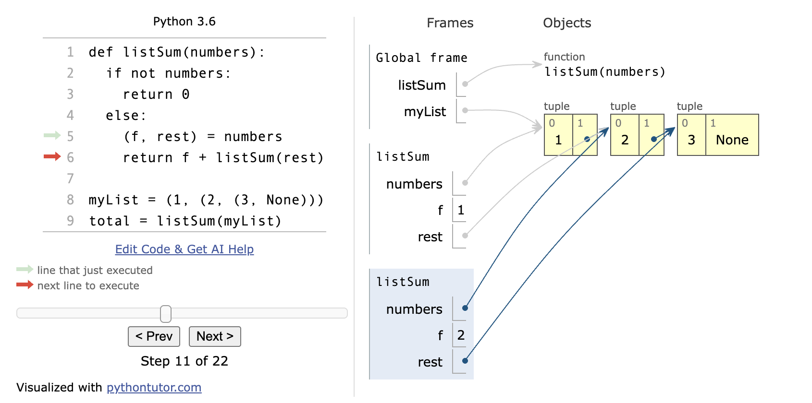

- range
	- range(5) --- 0\1\2\3\4；
	- range(1,4) --- 1\2\3；
	- range(5,0,-1) --- 5\4\3\2\1
	- range(1,4,2) --- 1\3
	- `for x in range()表达式中的range在第一次运行时就会确定(产生一个实例)，之后不会随参数改变而改变`
- 函数名可以直接赋值给一个变量，这样你就可以像使用该函数一样使用这个变量(本质上应该是函数指针)。
- `Note:我们都知道python对于类型的审查是很随意的因此使用时要小心。比如函数max也可能是某个int类型的变量。可以用环境图`

- ==环境图==Environment Diagram
	- 由多个Frame（比如Global Frame即全局框，一般有全局变量等）构成，能方便判断变量的作用域和其真正的含义。
		- 开始有全局Frame，然后==每当调用函数时，我们会产生一个新的Frame==。
	- 有一个[在线的可视化编程环境图](https://pythontutor.com/)能帮你直接绘制出你的环境图
	- 一个例图


- python中不显式返回值的函数返回None

- ==纯函数与非纯函数==
	- 纯函数就是 输入参数然后返回值，中间没有任何副作用。而非纯函数就是有副作用，比如打印函数就会在屏幕上显示东西的副作用

- ==函数文档/描述== 
	- 函数定义通常包括描述函数的文档，称为“文档字符串 docstring”，它必须在函数体中缩进。文档字符串通常使用三个引号，第一行描述函数的任务，随后的几行可以描述参数并解释函数的意图：
	```
		def pressure(v, t, n):
	        """计算理想气体的压力，单位为帕斯卡
	
	        使用理想气体定律：http://en.wikipedia.org/wiki/Ideal_gas_law
	
	        v -- 气体体积，单位为立方米
	        t -- 绝对温度，单位为开尔文
	        n -- 气体粒子
	        """
	        k = 1.38e-23  # 玻尔兹曼常数
	        return n * k * t / v
	```

	- 当你使用函数名称作为参数调用 `help` 时，你会看到它的文档字符串（键入 q 以退出 Python help）
