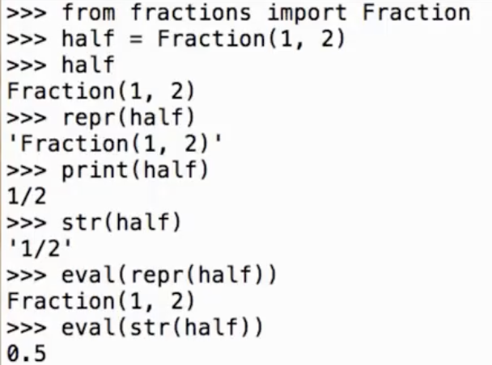
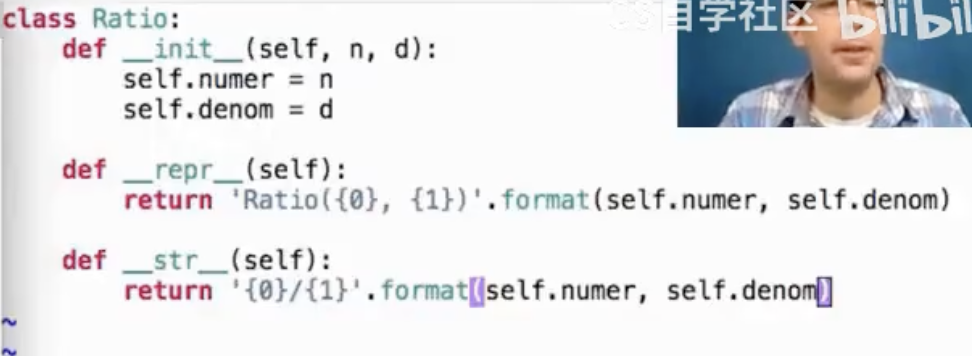
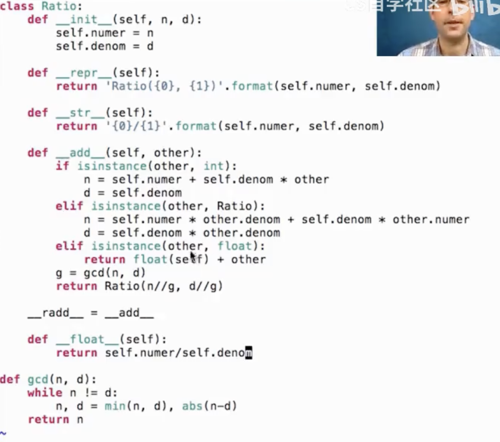

- 在python中所有object产生两种字符串表示
	- `str`对人类可读
	- `repr`对python解释器可读
- `str`和`repr`一般都是相同的，但是偶尔会不同

- python内置函数`repr(object)-->string` 和 `str(object)-->string`
	- 对大多数object，`eval(repr(object)) == object`
		- `eval`是评估python表达式
	- 调用`str`返回`print`打印出来的字符串

- 例子
	- ------------------------------------

- 在对string对象做调用时有有趣的洞见
	- `repr('hello') == "'hello'"`
	- `str('hello') == 'hello'`
	- 可见repr会将object直接用引号框起来变成字符串，而str只是将object变成字符串
	- 因此`eval(repr('hello'))`是正常的，因为`'hello'`是python表达式，但是`eval(str('hello'))`是错误的，因为`hello`不是python表达式
	- 可见eval的逻辑就是把最外层的字符串去掉评估里面的式子

- F-strings
	- `f'A is {A}'`
	- `{A}`是表达式A的结果
	- 表达式A会被python执行因此可能会产生副作用，比如列表pop元素

- Polymorphic Functions 多态函数
	- 适用于许多不同数据类型的函数，比如`repr`和`str`
	- `repr`本质上是调用一个类的零参数内置方法`__repr__`即
		- `half.__repr__() === repr(half)`
	- `str`也同理 
	- `repr`的实现
		- `def repr(x):`
			- `return type(x).__repr__(x)`

- Interfaces 接口
	- 一组共享的规范，以下文中的特殊方法名形式呈现与内置系统交流
	- class要满足`repr和str`接口需要的例子-------------

- Special Method Names
	- 特殊方法名 总是以两个下划线开始和结束
	- 它们以接口方式与python内置系统交流
		- `__init__`
		- `__repr__`
		- `__add__` 即 `a+b === a.__add__(b)` 
		- `__radd__`
		- `__bool__`
		- `__float__`
	- 在python中，可以简单将 特殊方法名 与 接口 概念等价，即在类中实现特殊方法其实就是为满足python内置系统的接口

- 完整的自定义类实现部分接口
	- ----------