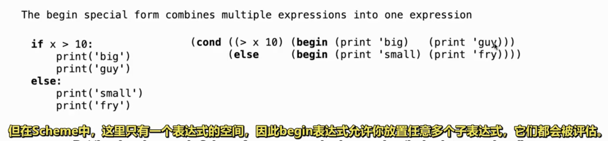
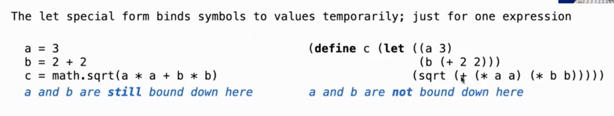

- [Scheme解释器网址](https://code.cs61a.org/)
- 
- 说明
	- Scheme是Lisp编程语言的方言，Lisp编程语言是古老的编程语言，被称为上帝的语言
	- 从Python学完过渡到 Scheme学习，可以领略按顺序==学习一门新语言需要==
		- 基础语法(expression)
		- 特殊形式(Control、define) + lambda
		- 环境图
		- 容器(创建、访问、bound method)
		- 异常处理
		- 类 + 特殊关键字
		- 并行 + 分布式
		- ....
	- 学习一门语言掌握到位，在于可以为其编写它的解释器 Interpreters

- Scheme基础语法
	- 算术运算
		- `(quotient 10 2) == 5` 
			- 操作符在前，操作数在后，整个表达式用括号框住。`quotient`是 `built-in integer division procedure` 即内置的整数除法过程
			- 在python中称为函数，在scheme中称为过程，本质一致
		- 可以嵌套调用表达式
			- `(quotient (+ 8 7) 5) == 3` 
			- 一个表达式也可以换行在多行，方便查看
		- 参数个数是可变的
			- `(+ 1 2 3 4) == 10`
			- `(+) == 0`
			- `(* 1 2 3 4) == 24`
			- `(*) == 1`
		- 由上述的 嵌套 + 可变参数 可以形成多种复杂表达式

	- 逻辑判断
		- `(number? 3) == t` 询问3是否是数字
		- `(zero? 2)==f` 询问2是否是0
		- `(integer? 2.2)==f`
		- `(< 1 0) == f`
		- `(= 1 1) == t`

- Special Forms 特殊形式
	- `If expression: (if <predicate> <consequent> <alternative>)`
		- 第一，评估 predicate
		- 第二，由真假决定评估 consequent 还是 alternative
	- `And 和 or: (and <e1> <e2> <e3> ...)` 和 `(or <e1> <e2> <e3> ...)`

	- `(define <symbol> <expression>)` 将新值绑定到符号 --- 它使用与python相同的Frame框架来展示环境
		- `(define pi 3.14)`
	- `(define (<symbol> <formal parameters>) <body>)` 将过程绑定到符号 --- 定义过程(函数)
		- 可以用递归函数 也可以嵌套定义函数 形成复杂应用

- Lambda表达式
	- `(lambda (<formal-parameters>) <body>)` 与python一样

- More Special Forms
	- `Cond & Begin` 
		- `(cond ((condi) (proce)) () (else (proce)))`用于解决if-elif-else语句![[Pasted image 20251014113659.png]]
		- Begin配合Cond使用将多个表达式合一
	- `(let ((a 1) (b 2)) (return))` 
		- 临时将符号绑定，只在一个表达式中生效