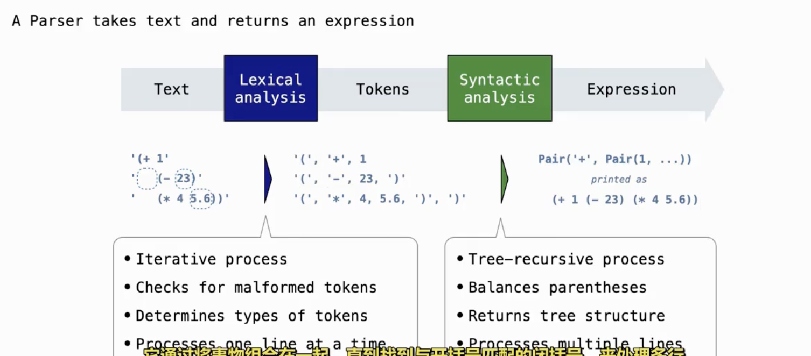
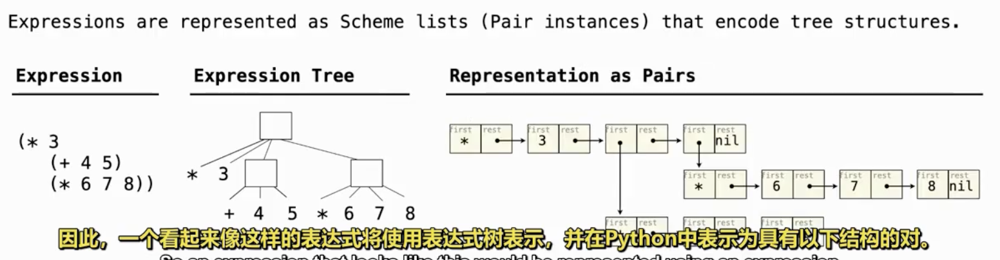
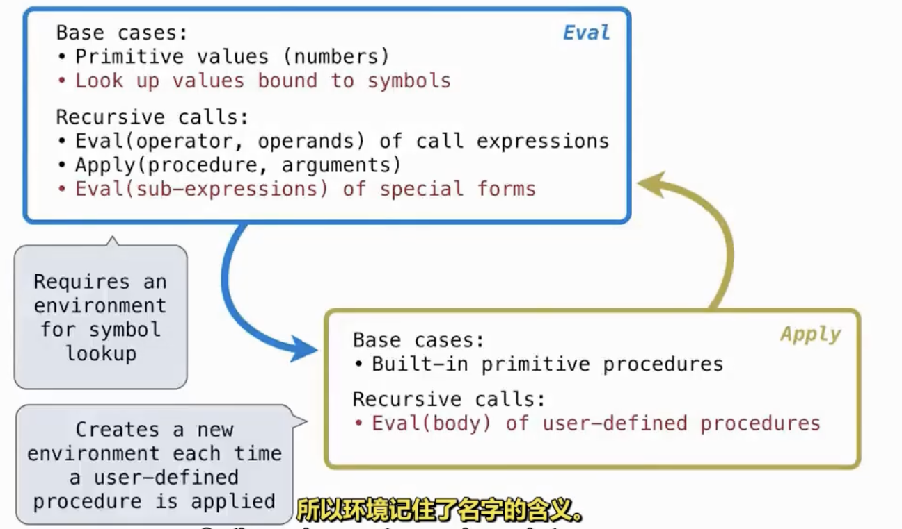
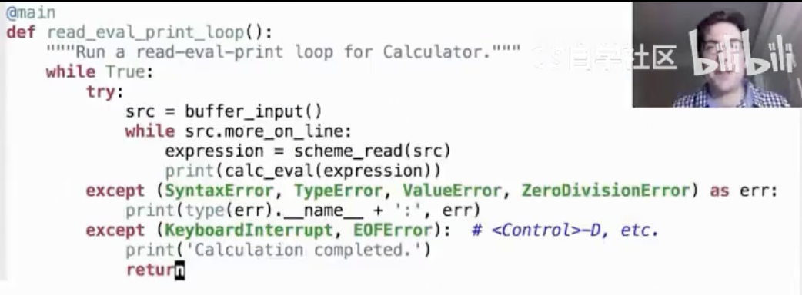

## 1 Exception 异常
---
- Python Raise 语句 `raise <expression>` --- 立即停止向上抛
	- 均需是BaseException的子类
		- TypeError
		- NameError
		- KeyError
		- RecursionError
		- ....

- Python Try 语句 `try: <suite> except <exception class> as <name>: <suite>`

## 2 Programming Languages
---
- 解释器
	- 程序是树
	- 解释器的工作方法就是通过树递归
	- 表达式通常包含子表达式的列表
	- 解释器的输入是另一个程序，而解释器可以是模块化和可拓展的
	- 一部分用于一般工作原理，另一部分封装语言的各部分细节
- 解释或编译
	- 解释是阅读程序并执行其行为
	- 编译是将其翻译成另一种语言

- Python在实际运行前被编译为称之Python字节码的东西，然后有运行这种较低级语言Python字节码的解释器

- A programming language = Syntax + Semantics

- Parsing 解析
	- 解析是将 文本转换为表达式树的过程，以便根据语言规则评估代码
	- 在演示中，将文本转换为 `pair`的过程就是 解析
	- 过程 `Text (Lexical analysis) --> Tokens (Syntactic analysis) --> Expression`
	- 在example的tokens2list中，我实现了一个简单的Syntactic analysis的过程
		- 我的逻辑是先变成list再转成pair但是一开始就用pair也行
	- ---------------
	- ------ 

- Evaluation 评估 与 Applying 执行
	- 评估函数返回表达式的值
	- 应用函数执行确切的运算操作，并返回运算结果
		- 评估函数需要调用应用函数来进行确切计算
	- 可以这样说
		- 评估函数是对 Expression 的进一步解析，搭建基本的处理流程
		- 应用函数是确切计算
	- ------ 

- 程序在各阶段可能抛出的错误
	- ---------------

- 交互设计
	- 解释器完整过程
		- `Text (Lexical analysis)--> Tokens (Synatic analysis) --> Expression(Eval+Apply) --> Value(Return)`
	- 对某些异常只进行打印，对于特殊异常进行程序终止
