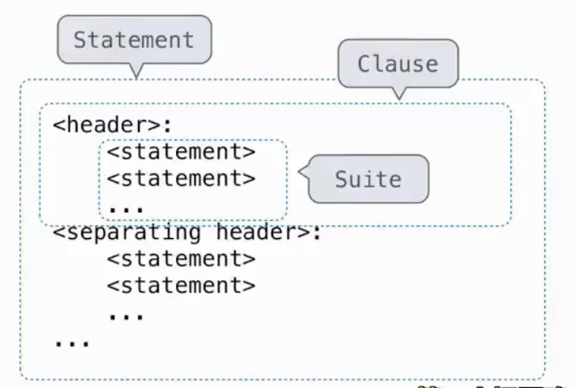

- python的一些杂项特性
	- python的==运算符== --- a/b是实数除法，a//b是C语言的除法，a\*\*b是求幂，a%b求余
	- python还有个值得注意的地方，在循环体或if判断内定义的变量生命和可访问性是可以拓展到外部的，而在函数内定义的变量只在函数内存在(根据环境图就能解释通了，赋值的本质是将该变量名与当前环境中第一帧的值绑定)
	- python==函数可以返回多个值==(本质我认为是tuple)
		- 同样的tuple赋值交换 `a,b = b,a`
	- python的==函数文档和文档测试==。python的函数文档之前说过了就是用一对三双引号围起来的描述该函数干了什么的注释(help能显示)，但是这里还有文档测试，它也在函数文档中，但是它需要三个`>`箭头表示是文档测试并在下方写出预估值，这样运行`python -m doctest -v <*>.py`就会执行这个文档测试看看是否有问题并显示输出(-v参数，如果不要该参数会检测但不会显示输出)。函数文档相当于给出了该函数使用的一个例子更方便使用。
	- 参数默认值 --- 当调用该函数时，具有默认值的参数是可选的。如果未提供，则将默认值绑定到形参上。（这个很常见了）

- Statements 语句 --- 语句可以执行操作或定义函数

- Compound Statements复合语句
	- Statement一整个复合语句、Clause一个从句、Suite套件一系列语句
		- 第一个header确定了语句的类型
	- 比如def语句、条件语句、循环语句等

- Condition Statement 条件语句
	- if、elif、else
- Iteration
	- While Statement while语句

- assert 语句用来判断真假
	- `assert <expression>,<discussion>`如果expressioin为假输出discussion否则无影响