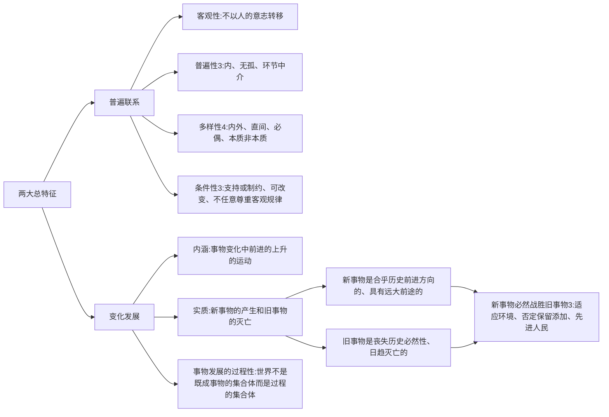
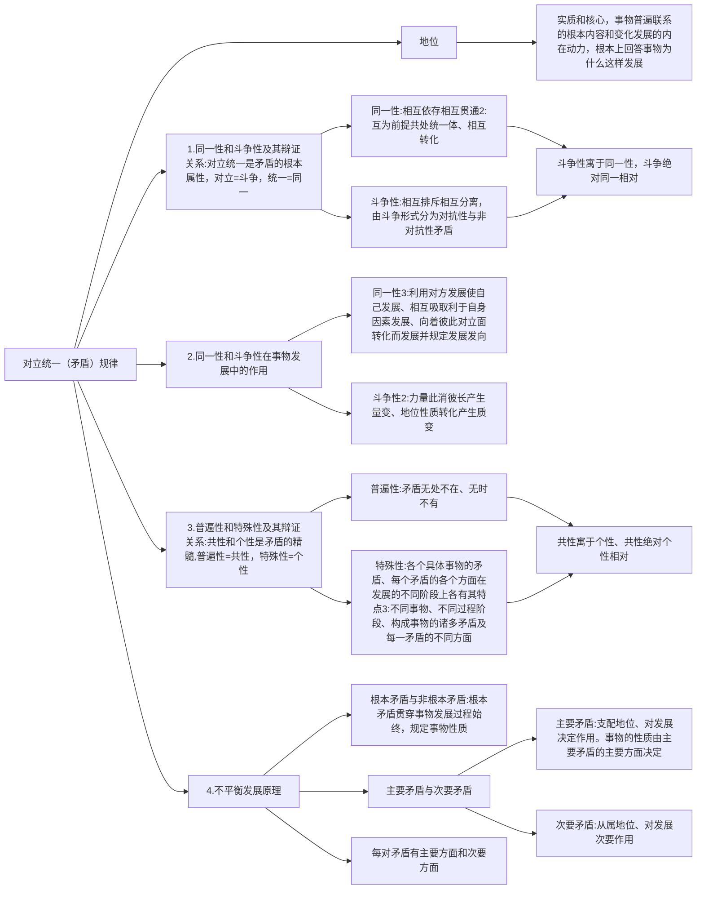

# 唯物辩证法

## 17 唯物辩证法两大总特征

```mermaid
graph LR
	A[两大总特征] --> B[普遍联系]
	A --> C[变化发展]
	B --> B1[客观性:不以人的意志转移]
	B --> B2[普遍性3:内、无孤、环节中介]
	B --> B3[多样性4:内外、直间、必偶、本质非本质]
	B --> B4[条件性3:支持或制约、可改变、不任意尊重客观规律]
	C --> C1[内涵:事物变化中前进的上升的运动]
	C --> C2[实质:新事物的产生和旧事物的灭亡]
	C2 --> C21[新事物是合乎历史前进方向的、具有远大前途的]
	C2 --> C22[旧事物是丧失历史必然性、日趋灭亡的]
	C21 --> C23[新事物必然战胜旧事物3:适应环境、否定保留添加、先进人民]
	C22 --> C23
	C --> C3[事物发展的过程性:世界不是既成事物的集合体而是过程的集合体]
```

## 18 对立统一规律

```mermaid
graph LR
	A[对立统一（矛盾）规律] ---> B[地位]
  B -->B1[实质和核心，事物普遍联系的根本内容和变化发展的内在动力，根本上回答事物为什么这样发展]
	A --> C[1.同一性和斗争性及其辩证关系:对立统一是矛盾的根本属性，对立=斗争，统一=同一]
	C --> C1[同一性:相互依存相互贯通2:互为前提共处统一体、相互转化]
	C --> C2[斗争性:相互排斥相互分离，由斗争形式分为对抗性与非对抗性矛盾]
	C1 --> C3[斗争性寓于同一性，斗争绝对同一相对]
	C2 --> C3
	A --> D[2.同一性和斗争性在事物发展中的作用]
	D --> D1[同一性3:利用对方发展使自己发展、相互吸取利于自身因素发展、向着彼此对立面转化而发展并规定发展发向]
	D -->D2[斗争性2:力量此消彼长产生量变、地位性质转化产生质变]
	A --> E[3.普遍性和特殊性及其辩证关系:共性和个性是矛盾的精髓,普遍性=共性，特殊性=个性]
	E --> E1[普遍性:矛盾无处不在、无时不有]
	E --> E2[特殊性:各个具体事物的矛盾、每个矛盾的各个方面在发展的不同阶段上各有其特点3:不同事物、不同过程阶段、构成事物的诸多矛盾及每一矛盾的不同方面]
	E1 --> E3[共性寓于个性、共性绝对个性相对]
	E2 --> E3
	A --> F[4.不平衡发展原理]
	F --> F1[根本矛盾与非根本矛盾:根本矛盾贯穿事物发展过程始终，规定事物性质]
	F --> F2[主要矛盾与次要矛盾]
	F --> F3[每对矛盾有主要方面和次要方面]
	F2-->F21[主要矛盾:支配地位、对发展决定作用。事物的性质由主要矛盾的主要方面决定]
	F2 --> F22[次要矛盾:从属地位、对发展次要作用]
```