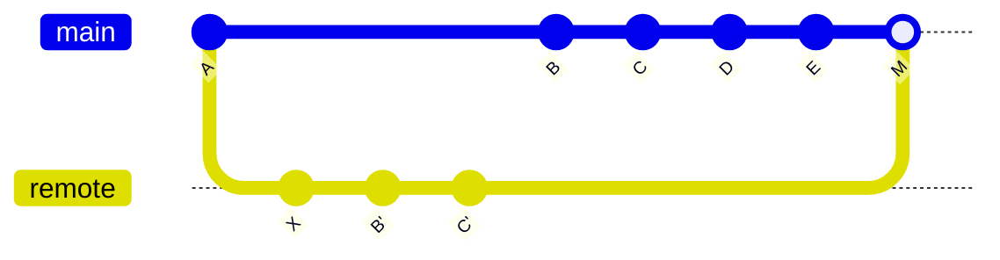

`merge` 和 `rebase` 都用于整合不同分支的提交。

两者最大的区别是：

* `merge`：保留原始分叉历史，通过新的 merge commit 合并。
* `rebase`：改写提交历史，把当前分支的提交重新接到目标分支之后，使历史变成一条直线。

<!-- more -->

## 基本场景

假设最初有：

```text
A → B → C
 \
  → X
```

其中：

* `C` 是当前分支最新提交。
* `X` 是另一条分支的提交。

---

## Merge

在 `C` 所在分支执行：

```bash
git merge xbranch
```

会生成新的 merge commit `M`：

```text
A → B → C → M
 \         ↗
  → X ────
```

`B`、`C`、`X` 原来的 commit 都不会改变。

如果别人已经基于 `C` 继续开发：

```text
A → B → C → D → E
 \       \
  → X ─→ M
```

之后将 `E` 与 `M` 再次 merge：

```text
          D → E ──→ N
         /         ↗
A → B → C →────→ M
 \             ↗
  → X ────────
```

Git 会找到 `E` 和 `M` 的共同祖先 `C`，然后比较：

```text
C → E
C → M
```

再合并两边的修改。

因此，`merge` 不会破坏别人已经依赖的历史。

---

## Rebase

如果不用 merge，而是在 `C` 所在分支执行：

```bash
git rebase xbranch
```

Git 会把 `B、C` 重新应用到 `X` 后面：

```text
A → X → B' → C'
```

注意：

```text
B ≠ B'
C ≠ C'
```

虽然代码内容可能基本相同，但由于父提交发生变化，commit hash 也会变化。

因此 rebase 本质上是：

```text
旧历史：

A → B → C
 \
  → X

新历史：

A → X → B' → C'
```

历史更加线性，但原来的 `B、C` 被新的 `B'、C'` 替代。

---

## 4. 为什么多人协作更常用 Merge

假设别人已经基于 `C` 开发：

```text
A → B → C → D → E
```

此时你把 `C` rebase 成 `C'`：

```text
A → X → B' → C'
```

别人仍然依赖旧的 `C`：

```text
A → B → C → D → E
```

而远程已经变成：

```text
A → X → B' → C'
```

Git 会把 `C` 和 `C'` 当作两个不同的提交，后续可能需要重新整理历史并产生额外冲突。



因此：

> 不要轻易 rebase 已经被别人依赖的公共提交。

---


## 总结

可以简单记成：

```text
merge  = 保留两条历史，再建立一个合并节点
rebase = 把自己的提交重新接到目标分支后面
```

使用原则：

| 场景           | 推荐       |
| ------------ | -------- |
| 个人、本地、未共享提交  | `rebase` |
| 多人协作、已经共享的提交 | `merge`  |
| 希望历史保持线性     | `rebase` |
| 希望完整保留真实分支历史 | `merge`  |


